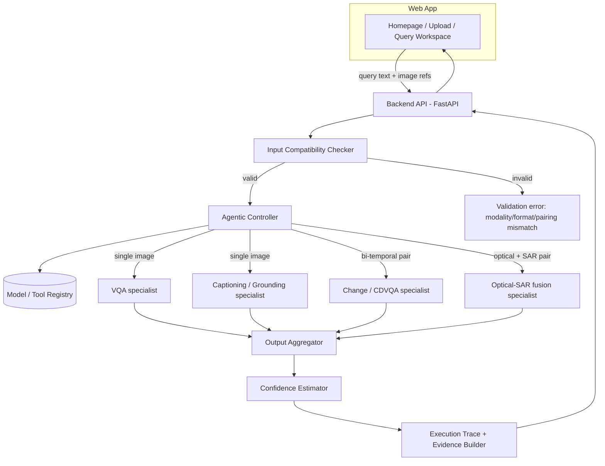
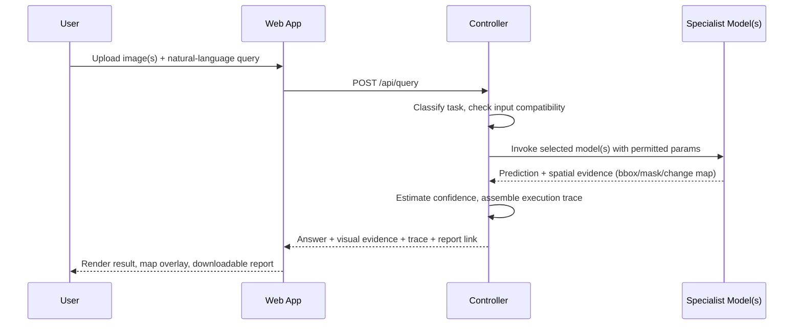

# SatQuery AI — Project Report & Build Guide
### An Agentic Vision-Language Assistant for Remote-Sensing Imagery

---

## 1. Executive Summary

SatQuery AI is an agentic, query-driven system that lets a non-expert ask natural-language questions about satellite imagery — a single image, a co-registered optical/SAR pair, or a bi-temporal pair — and get back an evidence-grounded answer instead of a raw classification score. The brief is explicit that a generic VLM will not satisfy the requirements: the system needs at least one remote-sensing-adapted vision component, a set of specialist tools (VQA, captioning/grounding, change understanding, optical–SAR fusion), and a controller that plans and executes across them, producing an auditable trace of what it did and why.

This report turns that brief into a concrete build plan: which datasets to use and for what, which model families are realistic to adapt in a hackathon/project timeframe, how to design the agentic controller so its behaviour is observable and gradeable, what the API and tech stack should look like, and how to build the homepage — including the 3D Earth visualization you asked for. A working homepage demo (3D rotating Earth, hero section, query bar) is provided alongside this report so you have something to run immediately, not just read about.

Since I don't have the code or write-up of the version you've already built, this is written as a complete reference blueprint. If you share your current repo or describe what's done, I can map these recommendations onto it directly and flag gaps rather than have you redo work.

---

## 2. What the Brief Actually Requires

| Dimension | Requirement |
|---|---|
| **Inputs** | Single optical/multispectral or SAR image · co-registered optical+SAR pair · bi-temporal pair (GeoTIFF/TIFF; PNG/JPEG only for benchmark datasets) |
| **Mandatory tasks** | Single-image VQA **+** (captioning **or** grounding) · bi-temporal change description/VQA · optical–SAR joint information extraction · agentic orchestration across all of the above |
| **Mandatory adaptation** | At least one vision/VLM component fine-tuned or domain-adapted (BigEarthNet.txt or other open data) — a stock LLM/VLM with no RS adaptation fails the brief outright |
| **Evaluation** | VRSBench, RSVQA, CDVQA on their official test splits, plus a held-out ISRO/SAC set of co-registered Cartosat-2S optical + RISAT SAR pairs |
| **Deliverable** | Interactive GUI/web app + agentic RS backend, with code, models, tests, and a demo |

The single hardest thing to get right is not any one model — it's making the **agentic orchestration itself legible**: the brief says explicitly that only the *observable* execution trace (task selected, tool/model used, parameters, outputs) is evaluated, not internal chain-of-thought. Design for that from day one rather than bolting on logging at the end.

---

## 3. System Architecture



**Query lifecycle:**



Five layers, each independently testable:
1. **Input Compatibility Checker** — validates modality, image count, format (GeoTIFF/TIFF vs. benchmark PNG/JPEG), co-registration/pairing, and basic metadata (CRS, resolution) before anything touches a model.
2. **Agentic Controller** — interprets the query, classifies the task, selects from the registry, sets only the permitted parameters for that task, and executes.
3. **Specialist models** — one per mandatory task (below).
4. **Aggregator + confidence estimator** — merges textual and spatial outputs, scores confidence (e.g. softmax margin, ensemble agreement, or a calibration head).
5. **Evidence & audit-trail builder** — the artifact that actually gets graded: task, model, parameters, and outputs, independent of any internal reasoning text.

---

## 4. Datasets & Benchmarks

| Dataset | Role in the project | Key facts |
|---|---|---|
| **BigEarthNet.txt** | Primary adaptation dataset (mandatory) | 464,044 *co-registered* Sentinel-1 SAR + Sentinel-2 multispectral image pairs with 9.6M text annotations — geographically-anchored captions, VQA pairs, and referring-expression/grounding labels, plus a 1,082-pair manually-verified benchmark split. This is a genuinely recent (2026) dataset, and it's a near-perfect fit for two mandatory requirements at once: it's the prescribed RS-adaptation corpus **and** it's inherently optical+SAR paired, so it can also seed your cross-modal fusion component. |
| **VRSBench** | Single-image captioning, grounding, VQA eval | 29,614 images (built on DOTA-v2/DIOR), 29,614 human-verified detailed captions, 52,472 referring expressions, 123,221 VQA pairs across 10 question types (category, presence, count, color, shape, size, position, direction, scene, reasoning). |
| **RSVQA (LR + HR)** | Single-image VQA eval | LR: 772 Sentinel-2 tiles (256×256, 10 m), 77,232 QA pairs, question types presence/comparison/rural-urban/count. HR: ~10,659 aerial images (512×512, 15 cm), 1,066,316 QA pairs, types presence/comparison/count. Both generated from OpenStreetMap. |
| **CDVQA** | Bi-temporal change VQA eval (mandatory) | Built from the public subset of the SECOND semantic change-detection dataset: 2,968 bi-temporal pairs (512×512, 0.5–3 m), 122,000+ auto-generated QA pairs over land-cover classes (buildings, water, vegetation, playgrounds, etc.), with pixel-level change masks available if you want to demonstrate the optional spatial change map. |
| **ISRO/SAC evaluation set** | Final held-out evaluation | Pre-georeferenced, co-registered **Cartosat-2S** optical + **RISAT** SAR pairs. Annotations withheld from teams — so your compatibility checker and controller must generalize to real Indian EO sensor characteristics, not just the training benchmarks' sensors. |

Practical note: since annotations for the ISRO/SAC set are undisclosed, the only way to validate readiness for it is to stress-test your pipeline on *out-of-distribution* optical/SAR pairs during development (different resolution, sun angle, incidence angle, speckle characteristics than BigEarthNet.txt) — don't only validate on held-out slices of the same training distribution.

---

## 5. Model Components

Each subsection maps 1:1 to a mandatory item in the brief's functional scope.

### 5.1 Remote-Sensing Domain Adaptation (mandatory backbone)

This is the component every other specialist can share, so get it right first.

- **Recommended:** Start from a CLIP-style RS foundation model — **RemoteCLIP** (ResNet-50 / ViT-B-32 / ViT-L-14 checkpoints are public) — and continue contrastive pretraining on BigEarthNet.txt's image–caption pairs so the encoder learns joint optical+SAR representations, not just optical. This gives you a shared visual backbone with RS-native semantics that every downstream specialist head can reuse (classic transfer-learning move: train once, fine-tune cheaply many times).
- **Alternative/complement:** If you need an instruction-following backbone rather than just an encoder, fine-tune a compact VLM (LLaVA-1.5-7B or Qwen2-VL-2B/7B) with **LoRA** on BigEarthNet.txt captions/VQA — this is the same recipe used by **GeoChat** (LLaVA-1.5 + LoRA on a 318k-instruction RS dataset) and **RS-LLaVA**, both of which are documented, reproducible starting points.
- **Why this satisfies the "mandatory adaptation" clause unambiguously:** the brief calls out BigEarthNet.txt by name as the adaptation dataset, and it's multisensor by construction, so adapting on it demonstrates domain adaptation to *both* optical and SAR characteristics, not just one.
- **Compute-constrained fallback:** freeze the backbone and train only a small projection/adapter layer (a few hours on a single GPU) rather than full LoRA fine-tuning — still counts as domain adaptation, just less capable.

### 5.2 Single-Image VQA (mandatory)

- Fine-tune the adapted backbone from 5.1 with a VQA instruction head on **RSVQA-LR + RSVQA-HR + VRSBench's VQA split**. Report accuracy broken out by question type (presence/comparison/count are the classic RSVQA categories; VRSBench adds color/shape/position/direction/reasoning) — question-type breakdowns are what every RS-VQA paper reports, and judges will likely expect the same granularity.
- If time is short, GeoChat's published zero-shot numbers on RSVQA-HR (~72% average accuracy without target-domain fine-tuning) are a reasonable baseline to beat, and give you a credible "before/after adaptation" story for your report.

### 5.3 Captioning **or** Grounding — pick one

You only need one, so pick based on demo impact:

- **Captioning** is simpler to fine-tune (backbone + language-model decoder head on VRSBench captions) and easier to evaluate (BLEU/METEOR/ROUGE/CIDEr, all standard).
- **Grounding** (text-guided region localization — e.g. "highlight the water body") is the more visually compelling demo for a judged evaluation, because it produces a bounding box overlay on the map instead of just text. GeoChat's approach — representing spatial coordinates as tokens the language model predicts directly — is the reference implementation to adapt; VRSBench's 52,472 referring expressions give you the training/eval data.
- **Recommendation:** if you have GPU time for only one, do grounding — it visibly demonstrates "evidence-grounded response," which is the brief's own phrase for what makes this more than a chatbot.

### 5.4 Bi-Temporal Change Understanding (mandatory)

- Architecture: Siamese dual-encoder (same RS-adapted backbone from 5.1 applied to both timestamps, weights shared) → a temporal-difference/fusion module (concatenation is reported as the strongest simple baseline in the original CDVQA paper) → a language decoder fine-tuned on **CDVQA** for change description/VQA.
- Train and evaluate on CDVQA's official splits (65,967 QA pairs / 1,600 pairs train; 16,441 / 400 pairs val).
- The brief's optional extra — a spatial change map — is available for free if reference masks exist in your data, since SECOND (CDVQA's source dataset) ships pixel-level semantic change masks; wiring a lightweight segmentation head onto the same fused features is a cheap way to satisfy that optional item.

### 5.5 Optical–SAR Cross-Modal Analysis (mandatory)

This is the newest and least standardized piece — treat it as your differentiator.

- Architecture pattern with the most consistent evidence in the literature: **early fusion** (concatenate optical + SAR features before the bulk of the network) has repeatedly outperformed late fusion for exactly the tasks the brief names — built-up and water-body extraction from Sentinel-1/2 pairs.
- Two implementation paths:
  1. **Lighter/classification path:** a dual-branch CNN encoder (one branch per modality) → early-fusion concatenation → segmentation/classification head for built-up vs. water vs. other, trained on BigEarthNet.txt (which is already co-registered S1+S2).
  2. **Fuller/VLM path (more impressive, more work):** follow the pattern used by **EarthGPT / EarthGPT-X** — a single instruction-tuned MLLM with a mixed visual encoder that ingests optical, SAR, and (optionally) infrared and answers questions jointly across modalities, rather than fusing at the feature level and bolting on a separate text decoder.
- Either path should support the brief's representative query verbatim: *"Use the optical and SAR images together to identify built-up and water-covered regions."*

### Model registry summary

| Task | Approach | Adaptation/eval data | Reference architecture |
|---|---|---|---|
| Backbone adaptation | Contrastive or LoRA fine-tune | BigEarthNet.txt | RemoteCLIP, GeoChat, RS-LLaVA |
| Single-image VQA | Instruction-tuned VQA head | RSVQA-LR/HR, VRSBench | GeoChat |
| Captioning/Grounding | Language decoder or coordinate-token grounding | VRSBench | GeoChat |
| Bi-temporal change | Siamese encoder + fusion + decoder | CDVQA (SECOND) | CDVQA baseline |
| Optical–SAR fusion | Dual-branch early fusion, or unified multi-sensor MLLM | BigEarthNet.txt | EarthGPT / EarthGPT-X |

---

## 6. The Agentic Controller (the actual novelty)

The brief is unusually specific about what the controller must do — treat this as a spec, not a suggestion:

1. Interpret the query and classify the requested task.
2. Check number, modality, format, metadata, and compatibility of the input images.
3. Select one or more models/tools from a predefined registry.
4. Configure only permitted task parameters and execute.
5. Combine textual and spatial outputs, estimate confidence, return visual evidence.
6. Produce an auditable execution summary: task, model/tool names, key parameters.

**Design it as a constrained function-calling loop**, not a free-form agent — this makes step 6 trivial instead of an afterthought. A small instruction-tuned LLM (or even a rule-augmented classifier for speed/determinism) picks from a fixed JSON tool registry; it cannot invent tools or parameters outside that schema.

Tool registry entry (example):

```json
{
  "tool_id": "cdvqa_change_v1",
  "task_type": "change_vqa",
  "accepts": {"input_type": "bi_temporal_pair", "modality": ["optical"], "formats": ["GeoTIFF", "TIFF"]},
  "parameters": {"question_type": ["binary", "trend", "class_transition"]},
  "outputs": ["answer_text", "change_map_optional", "confidence"]
}
```

Execution trace (what actually gets graded):

```json
{
  "query": "Has the built-up area increased, decreased, or remained unchanged?",
  "input_summary": {"type": "bi_temporal_pair", "modality": "optical", "format": "GeoTIFF", "n_images": 2},
  "selected_task": "change_vqa",
  "selected_tool": "cdvqa_change_v1",
  "parameters_used": {"question_type": "trend", "target_class": "built-up"},
  "confidence": 0.87,
  "evidence": {"change_map_ref": "changemap_0231.png"},
  "answer": "Built-up area increased, concentrated in the northeast quadrant."
}
```

Internal chain-of-thought the controller uses to get there is explicitly **not** evaluated per the brief — so don't spend effort making that pretty; spend it making the trace above complete and consistent for every single request type, including error/invalid-input cases.

**Confidence estimation**, in rough order of implementation cost: (a) softmax margin / top-1-vs-top-2 gap from the specialist model, (b) agreement across an ensemble of 2–3 checkpoints, (c) a small calibration head trained to predict correctness. Start with (a); it's free and defensible.

---

## 7. Suggested Tech Stack

| Layer | Technology | Why |
|---|---|---|
| Backend API | Python, FastAPI | Async, typed, plays well with ML serving and background jobs for slow model calls |
| Model serving | Hugging Face Transformers (+ PEFT/LoRA for fine-tuning); vLLM or TGI if you need throughput | Standard, well-documented for exactly the LLaVA/Qwen-VL-style models above |
| Geospatial I/O | `rasterio`, `rioxarray`, GDAL | GeoTIFF read/write, CRS handling, co-registration checks in the compatibility layer |
| Orchestration | A thin custom controller (function-calling schema above) — a framework like LangGraph is optional, not required, since the brief wants an auditable trace, not a general-purpose agent framework | Keeps the "only the execution trace is evaluated" requirement simple to satisfy |
| Storage | Object storage (S3-compatible or local disk) for images/reports; Postgres (+PostGIS if you want spatial queries) or SQLite for metadata and job records | PostGIS is a nice-to-have if you outgrow SQLite, not a requirement |
| Frontend | React + Vite, Tailwind CSS | Fast iteration; pairs with Three.js/react-globe.gl for the homepage globe |
| 3D Earth | Three.js (directly, or via `react-globe.gl` / `@react-three/fiber`+`drei`) | See Section 9.1 |
| Report export | `reportlab` or `WeasyPrint` (HTML→PDF) for the downloadable evaluation report | Keeps the report generator decoupled from the model code |

---

## 8. API Design

| Endpoint | Method | Purpose |
|---|---|---|
| `/api/upload` | POST | Upload image(s), returns validated metadata (modality, format, CRS, resolution) or a compatibility error |
| `/api/query` | POST | Body: `{query, image_refs[]}` → runs the full controller pipeline, returns answer + evidence + trace |
| `/api/tools` | GET | Lists the current model/tool registry (useful for the UI to show "what can I ask") |
| `/api/trace/{query_id}` | GET | Re-fetch a past execution trace |
| `/api/report/{query_id}` | GET | Downloadable PDF/HTML report for one query |

---

## 9. Frontend & UX Guide

### 9.1 Homepage — the 3D Earth model

A working demo of this homepage (rotating textured Earth, hero copy, query bar) is provided as a companion artifact to this report — treat the notes below as the "why," and the artifact as the "here's the code."

**Implementation options, cheapest to richest:**

1. **Plain Three.js** (no framework dependency): a `SphereGeometry` with an Earth-color texture map, a lower-opacity cloud-layer sphere slightly larger than the Earth sphere rotating at a different speed, a thin Fresnel-shader rim for atmosphere glow, and slow auto-rotation via `requestAnimationFrame`. This is what the companion demo uses — it's portable into any stack, including a plain HTML homepage or a React app via a `useRef` + `useEffect` mount.
2. **`react-globe.gl`** (built on Three.js/WebGL): if your actual frontend is React and you want data overlays later — e.g. plotting the geographic locations of your benchmark datasets, or arcs between a sample query's before/after image locations — this gives you points/arcs/polygons layers for free, at the cost of an extra dependency. This is the same family of library behind the well-known GitHub homepage globe.
3. **CesiumJS**: overkill for a homepage hero, but worth knowing about if a *later* screen in your app needs real terrain, true geographic projection, or draping actual GeoTIFF tiles onto the globe (e.g., showing the literal Cartosat-2S footprint) rather than a stylized decorative Earth.

**Practical notes:**
- Respect `prefers-reduced-motion` — pause rotation for users who've set it.
- Provide a static fallback image for the rare case WebGL is unavailable.
- Keep the globe decorative/hero-only; don't try to make it the actual image-analysis viewer — use a 2D map/image viewer (e.g., Leaflet or OpenLayers, which handle GeoTIFF overlays and bounding-box annotations far better) for the query workspace where users actually inspect results.

### 9.2 Upload & Compatibility screen

Surface the Input Compatibility Checker's output directly: detected modality, format, image count, whether a pair is properly co-registered, and a clear rejection reason if not (e.g., "SAR image provided without a matching optical pair for cross-modal analysis").

### 9.3 Query Workspace

- Natural-language query box (autocomplete against the brief's representative query patterns is a nice touch).
- Image/map viewer with bounding-box/change-map overlay for evidence.
- A visible **execution trace panel** — literally render the JSON from Section 6 in a readable form. This directly demonstrates the "auditable execution summary" requirement to anyone evaluating the system, including a non-technical judge.
- Confidence indicator (simple percentage or a calibrated traffic-light is fine).

### 9.4 Reports

One-click export of a query (or a batch) to a PDF/HTML report bundling the query, answer, evidence images, and trace — this satisfies the "downloadable reports" line in the Expected Solution section directly.

---

## 10. Evaluation Strategy

| Mandatory task | Benchmark | Typical metric |
|---|---|---|
| Single-image VQA | RSVQA-LR/HR, VRSBench-VQA | Accuracy overall + by question type |
| Captioning (if chosen) | VRSBench-Cap | BLEU-1..4, METEOR, ROUGE-L, CIDEr |
| Grounding (if chosen) | VRSBench-Referring | Accuracy@IoU (e.g., acc@0.5) |
| Bi-temporal change | CDVQA | Accuracy by change-question type |
| Optical–SAR fusion | BigEarthNet.txt benchmark split | Task-appropriate (classification F1 / VQA accuracy, per how you frame the task) |
| Final held-out | ISRO/SAC Cartosat-2S + RISAT set | Whatever the organizers specify, normalized before combining across tasks |

Since the brief says scores will be **normalized before combining different metrics**, keep every metric's raw scale and distribution logged separately (not just a final blended number) — you'll want that for your own report and to sanity-check the organizers' combined score.

---

## 11. Implementation Roadmap

| Phase | Focus | Key outputs |
|---|---|---|
| 0 — Setup | Data pipeline for GeoTIFF/TIFF I/O, compatibility checker, project scaffolding (backend + frontend skeleton) | Ingest + validate all five benchmark datasets end-to-end |
| 1 — Backbone & single-image tasks | Adapt backbone on BigEarthNet.txt; train VQA + (captioning or grounding) heads | Working single-image demo, RSVQA/VRSBench eval numbers |
| 2 — Multi-image tasks | Bi-temporal change model on CDVQA; optical–SAR fusion model on BigEarthNet.txt | Working change-VQA and fusion demos |
| 3 — Agentic controller | Tool registry, task classifier, execution trace, confidence estimator | End-to-end query → routed answer → trace |
| 4 — Frontend | Homepage (3D Earth), upload screen, query workspace, trace panel, report export | Full interactive GUI wired to the backend |
| 5 — Integration & hardening | Run against out-of-distribution optical/SAR pairs, edge cases, error paths | System behaves sanely on inputs resembling the ISRO/SAC set |
| 6 — Packaging | Tests, docs, demo video/script, final report | Deliverables bundle |

Adjust phase lengths to your actual deadline and team size/compute — this is a dependency order, not a fixed calendar.

---

## 12. Risks & Mitigations

| Risk | Mitigation |
|---|---|
| Optical–SAR fusion underperforms — least mature area in the literature | Start with the simpler early-fusion CNN path (5.5, option 1); treat the unified-MLLM path as a stretch goal |
| Domain gap between training benchmarks and the undisclosed ISRO/SAC Cartosat-2S/RISAT pairs | Validate on deliberately out-of-distribution optical/SAR pairs during development, not just held-out slices of the same datasets |
| Compute/time constraints for fine-tuning multiple specialist models | Share one adapted backbone (5.1) across all heads; use LoRA/adapter fine-tuning instead of full fine-tunes; fall back to zero-/few-shot GeoChat/EarthGPT-style prompting where a head can't be trained in time |
| Controller's internal reasoning becomes the focus instead of the trace | Design the tool-registry + trace schema first (Section 6); build the controller to fill that schema, not the reverse |
| 3D-earth hero hurts performance/accessibility | Static-image fallback, `prefers-reduced-motion` support, lazy-load the WebGL canvas |

---

## 13. Deliverables Checklist

- [ ] Interactive GUI/web app with the four workspaces (home, upload, query, reports)
- [ ] Agentic backend with input compatibility checker, task router, tool registry, aggregator, confidence estimator, trace builder
- [ ] At least one RS-adapted vision/VLM component (BigEarthNet.txt-based)
- [ ] Single-image VQA + one of {captioning, grounding}
- [ ] Bi-temporal change description/VQA (+ optional change map)
- [ ] Optical–SAR cross-modal analysis
- [ ] Evaluation results on VRSBench, RSVQA, CDVQA official splits
- [ ] Code, trained model checkpoints, tests, and a runnable demo
- [ ] Downloadable per-query report generation

---

## 14. Key References

- RemoteCLIP — https://arxiv.org/abs/2306.11029
- GeoChat — https://arxiv.org/abs/2311.15826
- RS-LLaVA / EarthGPT — https://arxiv.org/abs/2401.16822
- EarthGPT-X — https://arxiv.org/abs/2504.12795
- BigEarthNet.txt — https://arxiv.org/abs/2603.29630
- VRSBench — https://arxiv.org/abs/2406.12384
- RSVQA — https://arxiv.org/abs/2003.07333
- CDVQA — https://arxiv.org/abs/2112.06343
- react-globe.gl — https://github.com/vasturiano/react-globe.gl

---

*This report is a technical blueprint synthesized from your project brief and current (2024–2026) remote-sensing VLM literature. Model choices should be validated against your actual compute budget and timeline before committing.*
